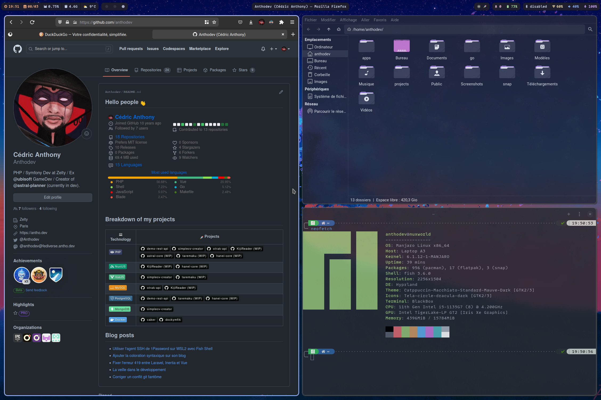

# .dotfiles

This repo is for stocking the configuration of several of the application i use on Linux/WSL as well as the desktop configuration of my Linux setup.

## HyprLand rice
My Linux desktop is running on the following setup:
- **OS:** Manjaro (Sway Edition)
- **WM (Window Manager):** [HyprLand](https://github.com/hyprwm/Hyprland)
- **Greeter:** sddm (with [sugar-candy](https://www.pling.com/p/1312658) theme)
- **Shell:** [Fish Shell](https://github.com/fish-shell/fish-shell) (running with [Tide](https://github.com/IlanCosman/tide) theme)
- **Bar:** [Waybar](https://github.com/Alexays/Waybar)
- **Theme:** [Catppuccin](https://github.com/catppuccin/gtk) Macchiato Lavendar Dark
- **Icons:** [Tela Circle](https://www.pling.com/p/1359276/) Dracula Dark
- **Terminal:** [Blackbox](https://gitlab.gnome.org/raggesilver/blackbox)

Font used: [MonoLisa](https://monolisa.dev) (patched with Nerd Fonts)

## Packages requirement
- sddm-git
- hyprland
- xdg-desktop-portal-hyprland-git
- fish
- waybar-hyprland
- [rofi](https://github.com/davatorium/rofi) (with [Rofi themes](https://github.com/adi1090x/rofi))
- thunar
- [hyprpaper](https://github.com/hyprwm/hyprpaper)
- pamac-manager
- playerctl
- pavucontrol
- brightnessctl
- wlogout
- swaylock
- pw-volume
- grim
- slurp

## Optional packages
- btop
- neovim
- tmux
- wf-recorder
- [spicetify](https://github.com/spicetify/spicetify-cli)
- ripgrep
- fd
- procs
- fzf
